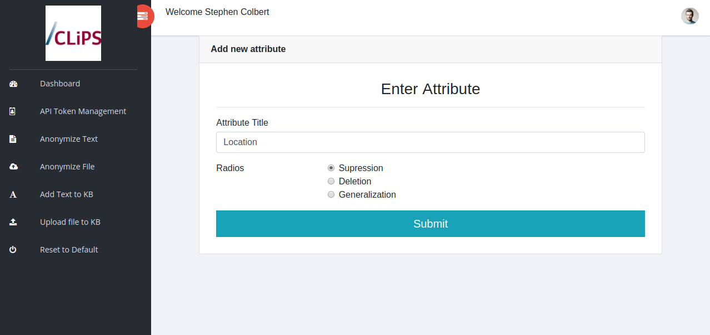
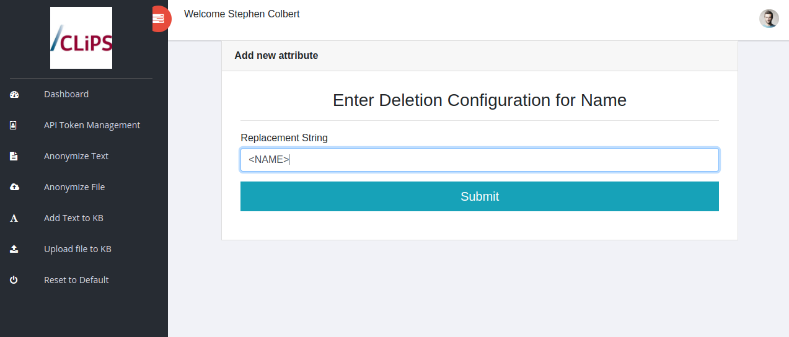
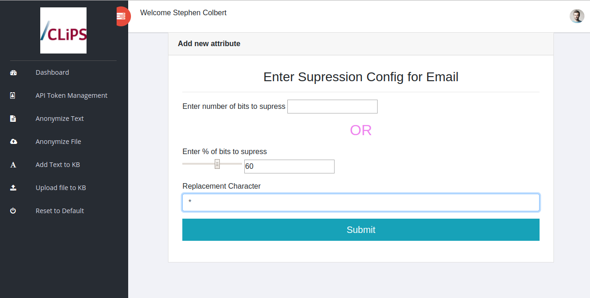
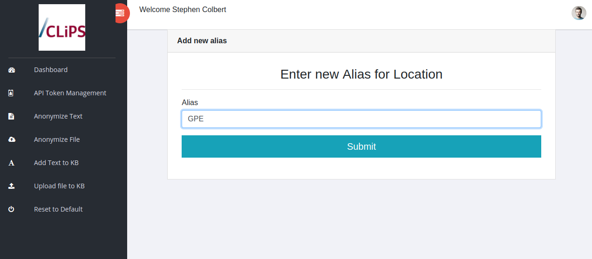
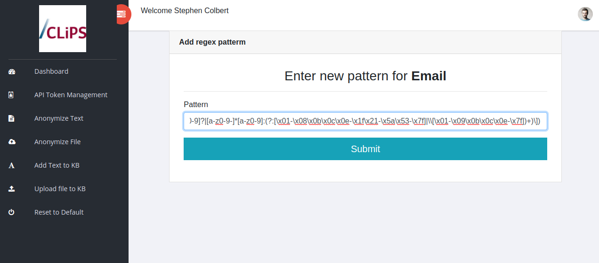
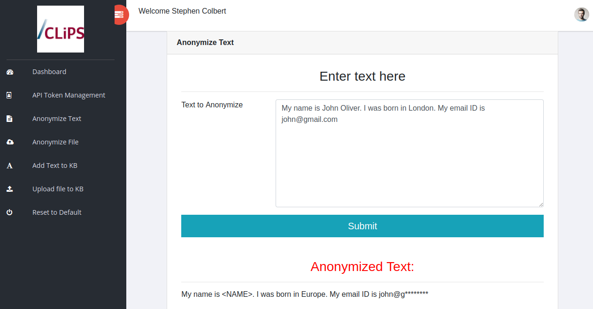
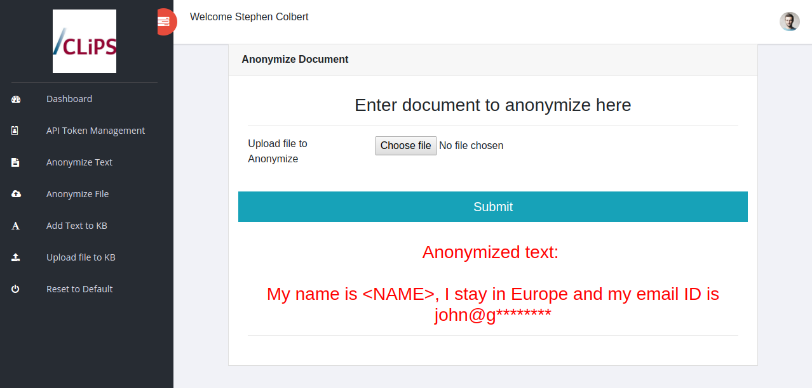
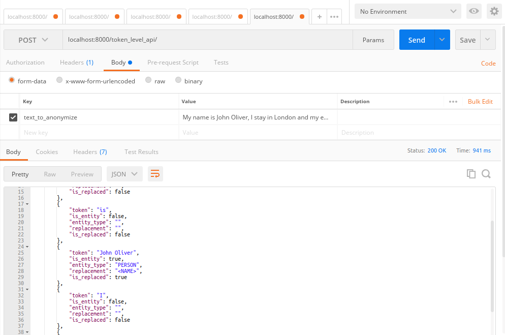
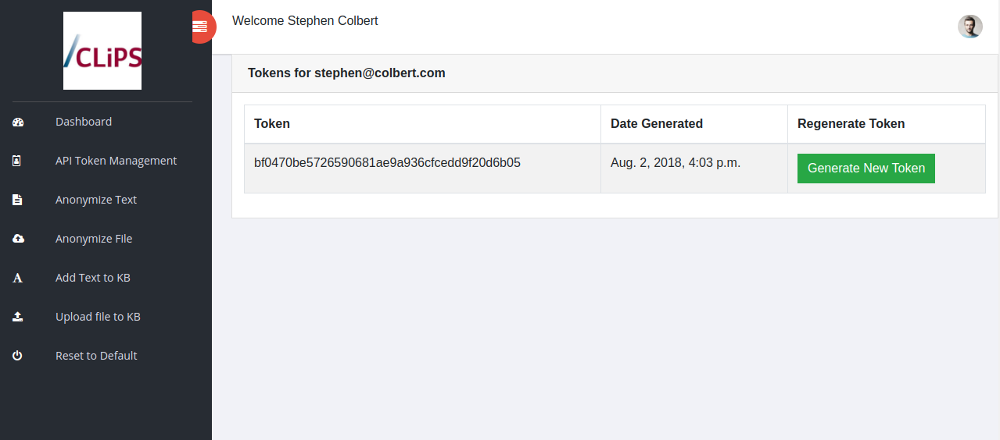
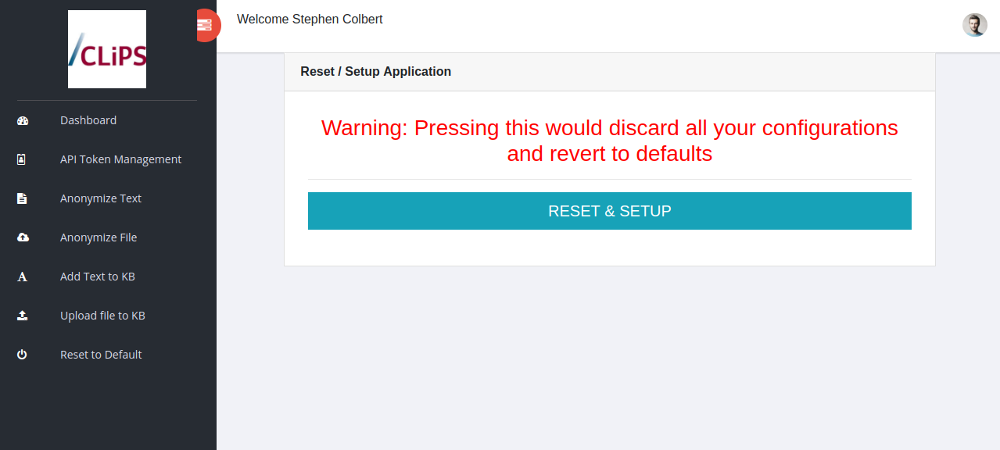

# Text Anonymizer Usage Guide

## Login/Registration:

The user must register/login in order to be able to use the application. This is meant to keep user&#39;s anonymization configuration and TF-IDF knowledge-bases private.

## Dashboard:

On the dashboard, the user has access to all the application&#39;s functionalities.

_Standard Dashboard_

In order to set attributes to anonymize, the user has to do two things

i) Configure the anonymization action

ii) Set a way for the attribute to be detected.

### i) Configuring the anonymization / Adding an attribute

1) Click on &quot;Add Attribute&quot;

_Choosing the kind of anonymization_

2) Select the kind of anonymization you want

  2.1) Deletion:

To be used in certain cases where retaining a part of the attribute through the other anonymization methods too is not appropriate. Completely replaces the attribute with a pre-set replacement. Example: My name is John Doe would be replaced by My name is \&lt;Name\&gt;.

_Choosing replacement string for deletion_

When choosing deletion, you need to provide the system with a replacement string.

  2.2) Generalization:

 To be used when the entity is sensitive enough to need anonymization but can still be partially retained to provide information. This system has two methods of carrying out generalization

- Word Vector Based: In this option of generalization, the nearest neighbor of the word in the vector space is utlilized to generalize the attribute. Example: I live in India get&#39;s generalized to I live in Pakistan. This method, while completely changing the word largely retains vector space information useful in most NLP and Text Processing tasks
- Part Holonym Based: In this option, the system parses the [Wordnet Lexical Database](https://wordnet.princeton.edu/) to extract part holonyms. This method works exceptionally well with geographical entities. In this, the user can choose the level of generalization. Example: I live in Beijing get&#39;s generalized to I live in China at level 1 generalization and to I live in Asia at level 2 of generalization.

_Choosing the generalization type_

  2.3) Suppression:

 To be used when hiding a part of the information is enough to protect the user&#39;s anonymity. The user can supply the percentage or the number of bits they want to be supressed. Example: My phone number is 9876543210 would be replaced by My phone number is 98675\*\*\*\*\* if the user chooses 50% supression.

The user get&#39;s to choose between two types of suppressions and the replacement character (&quot; \* &quot; by default):

- Percentage to be suppressed: Suppresses the given percentage of bits
- Number of bits to be suppressed: Suppresses the given number of bits. If the number of bits configured to be suppressed exceeds the number of bits in the text, the entire text is replaced with the bits.

_Configuring suppression_

### ii) Set a way for the attribute to be detected

There are two general ways in which the attribute just added can be setup for detection.

1) Setting up the alias for the NER system: Each NER system gives tags to attributes. Since a user might choose to integrate several NER systems at once together, the user can add multiple aliases or tags to a given attribute.

For example: The entity &quot;Location&quot; could be tagged as &quot;GPE&quot; in one NER system and &quot;LOC&quot; in another NER system. Adding both the aliases will ensure that the entity gets flagged by one system if the other one misses it. (Note: Only Spacy&#39;s NER system is currently fully integrated)

You can add an alias by clicking on &quot;Add Alias&quot; next to an attribute on the Dashboard.

_Adding an alias for an attribute_

_2)_ Adding a regex pattern for an attribute In case NER systems do not have support for the kind of attribute you wish to detect, you can add custom regex patterns to help tag/identify the attribute.

For example: Adding regex patterns for Email IDs or URLs etc.

_Adding a regex pattern for email_

_3)_ Detecting Attributes using TF-IDF: The third method in which the system detects attributes/tokens that have to be anonymized is by using TF-IDF. The system assigns TF-IDF scores to tokens in order to determine their importance. Tokens above a certain limit will directly be deleted. Since TF-IDF helps us determine only whether or not an attribute is sensitive but not what kind of an attribute is something, the system currently only support deletion of the same. Adding documents to the TF-IDF knowledge base is covered later in this guide.

## Anonymization

This system offers multiple options for text to be anonymized.

#### Through GUI:

1. By entering Text:

The user can directly enter the text he wishes to be anonymized in a box

_Anonymizing text entered_

2) By uploading a file:

In case the user wishes to anonymize text in an uploaded file, the user can do that too. The uploaded file will NOT be saved on the server.

_Uploading a file to be anonymized_

#### Through API:

Authentication via API: While making any request via the API, the authentication token needs to be included in the header in the format:

    {"Authorization" : "Token <your_token_here>"}

1) By directly making a POST request with the plaintext in the body.

To directly make a POST request, the url is /anonymize\_text\_api/ and in the Body, set

    {"text_to_anonymize" : "<Insert_Text_Here>"}

In case, you wish to get token level details, make the request to: /token\_level\_api/

_Token level API response_

2) By uploading the file via a POST request

To make a POST request by uploading a file, the url is /anonymize\_uploaded\_file\_api/ and in the body, set

    {"file_to_anonymize" : <attach file here>}

The response is by default at the token level.

## Adding a file/text to the TF--IDF Knowledgebase

#### Via GUI:

Text can be added to the TF-IDF knowledgebase in the same way as anonymizing text. The user can either enter the text directly or upload the file. The links are provided in the navigation bar.

#### Via API:

Authentication via API: While making any request via the API, the authentication token needs to be included in the header in the format:

    {"Authorization" : "Token <your_token_here>"}

A file can directly be added by making a POST request to

/upload\_file\_to\_knowledgebase\_api/

With the parameters in body set as:

    {"file_to_anonymize": <attach_file_here>}

## API Authentication Token Management

The API endpoints use system generated tokens for authentication. At the API Token Management page, you can regenerate your token. Regenerating a token will render your previous token void. A user can at any point have just one active authentication token.

Do not share your API Authentication token with other users. It is sensitive information, like your password.

_Authentication Token Management Page_

## Resetting to Defaults

The user can discard all configurations and reset the application to default.
